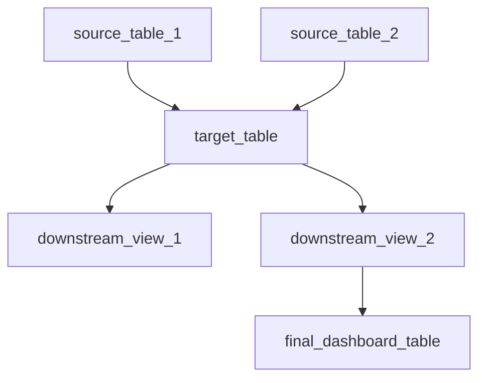
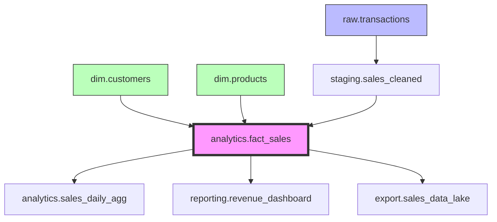

# Data Lineage Documentation Skill

Automatically generate comprehensive data lineage documentation from BigQuery tables. Creates visual Mermaid diagrams showing upstream and downstream dependencies, documents data flows, and provides impact analysis.

## Workflow

### 1. Discover Table Dependencies

- **Identify target table**: Get the fully-qualified table ID (project.dataset.table)
- **Fetch upstream dependencies**: Query tables/views that the target depends on
- **Fetch downstream dependencies**: Query tables/views that depend on the target
- **Recursive traversal**: Optionally trace dependencies multiple levels deep
- **Build dependency graph**: Map the complete lineage network

### 2. Gather Metadata

For each table in the dependency chain:
- **Table metadata**: Creation date, last modified, row count, size
- **Schema information**: Column names, types, descriptions
- **View definitions**: SQL logic for views and materialized views
- **Partitioning/clustering**: Performance optimization details
- **Ownership information**: Dataset and project context

### 3. Analyze Data Flows

- **Identify data sources**: Trace back to original data sources
- **Map transformations**: Document view logic and transformation steps
- **Detect patterns**: Identify common transformation patterns
- **Calculate impact**: Determine how changes ripple through the lineage
- **Highlight critical paths**: Flag important dependencies

### 4. Generate Mermaid Diagrams

Create visual representations:


- **Upstream lineage**: Show all data sources feeding into the target
- **Downstream lineage**: Show all consumers of the target table
- **Full lineage**: Combined view of entire dependency network
- **Color coding**: Distinguish tables, views, and materialized views
- **Annotations**: Add metadata like row counts and update frequency

### 5. Document Data Flows

Generate comprehensive markdown documentation:

```markdown
# Data Lineage: [Table Name]

## Overview
- **Table**: project.dataset.table
- **Type**: Table/View/Materialized View
- **Rows**: 1.2M
- **Size**: 45 GB
- **Last Updated**: 2026-01-12

## Upstream Dependencies
Tables and views that feed into this table:
1. **source_table_1** - [description]
2. **source_table_2** - [description]

## Downstream Dependencies
Tables and views that depend on this table:
1. **downstream_view_1** - [description]
2. **downstream_view_2** - [description]

## Impact Analysis
Changes to this table will affect:
- 5 downstream views
- 2 dashboard tables
- 3 data export jobs

## Data Flow
[Detailed description of how data flows through this table]

## Transformation Logic
[For views: document the SQL transformation logic]
```

### 6. Perform Impact Analysis

- **Change impact**: What breaks if this table changes?
- **Dependency depth**: How many layers of dependencies?
- **Critical consumers**: Which downstream tables are most important?
- **Update frequency**: How often does data refresh?
- **SLA requirements**: What are the data freshness requirements?

### 7. Generate Reports

Create multiple documentation outputs:
- **Single table lineage**: Focused view of one table
- **Dataset lineage map**: All tables in a dataset
- **Cross-dataset lineage**: Dependencies across datasets
- **Impact assessment**: Analysis for proposed schema changes
- **Lineage catalog**: Index of all documented tables

## Use Cases

### Table Documentation
```
User: "Document the lineage for analytics.fact_sales"

1. Query upstream and downstream dependencies
2. Generate Mermaid diagram showing full lineage
3. Document transformation logic from source to consumption
4. Create markdown file with complete lineage documentation
```

### Impact Analysis
```
User: "What happens if I change the schema of dim_customers?"

1. Find all downstream dependencies
2. Analyze which views/tables will break
3. Identify affected dashboards and reports
4. Generate impact assessment report
5. Recommend migration strategy
```

### Dataset Mapping
```
User: "Map all data flows in the analytics dataset"

1. List all tables in the dataset
2. Query dependencies for each table
3. Create comprehensive dataset lineage map
4. Generate cross-table dependency matrix
5. Document critical data paths
```

### Change Planning
```
User: "I want to deprecate raw_events table"

1. Find all downstream consumers
2. Document alternative data sources
3. Create migration plan
4. Identify testing requirements
5. Generate deprecation timeline
```

## Integration Points

- **BigQuery INFORMATION_SCHEMA**: Query metadata and dependencies
- **View definitions**: Extract SQL logic from views
- **Git repository**: Store generated documentation
- **CI/CD pipelines**: Auto-generate docs on schema changes
- **Data catalogs**: Export to metadata management systems

## Output Formats

### Mermaid Diagrams
- `lineage_upstream.mmd`: Upstream dependencies only
- `lineage_downstream.mmd`: Downstream dependencies only
- `lineage_full.mmd`: Complete bidirectional lineage
- `lineage_dataset.mmd`: All tables in dataset

### Markdown Documentation
- `LINEAGE.md`: Main documentation file
- `IMPACT_ANALYSIS.md`: Change impact report
- `DATA_FLOWS.md`: Detailed flow documentation
- `DEPENDENCY_MATRIX.md`: Cross-table dependencies

### Structured Data
- `lineage.json`: Machine-readable dependency graph
- `impact.json`: Impact analysis data
- `metadata.json`: Table metadata collection

## Best Practices

### Discovery
- Start with target table and expand outward
- Set depth limits for recursive traversal (avoid infinite loops)
- Cache metadata to reduce API calls
- Handle circular dependencies gracefully

### Visualization
- Keep diagrams readable (max 20 nodes per diagram)
- Use hierarchical layouts for complex lineages
- Color code by table type (table/view/materialized view)
- Add tooltips with metadata

### Documentation
- Document transformation logic for views
- Explain business purpose of each table
- Note data quality considerations
- Include refresh schedules
- Link to related documentation

### Maintenance
- Regenerate lineage docs when schemas change
- Version control lineage documentation
- Archive historical lineage snapshots
- Alert on broken dependencies

## Advanced Features

### Lineage Depth Control
```
# Shallow: Direct dependencies only (depth=1)
# Medium: Two levels deep (depth=2)
# Deep: Full recursive traversal (depth=∞)
```

### Filtering Options
- Filter by dataset
- Filter by table type
- Filter by update recency
- Exclude deprecated tables

### Visualization Customization
- Horizontal vs vertical layouts
- Grouping by dataset
- Highlighting critical paths
- Showing row counts and sizes

### Change Detection
- Compare current vs previous lineage
- Detect new dependencies
- Flag removed dependencies
- Highlight schema changes

## Collaboration

Works well with:
- **schema-doc-generator skill**: For detailed schema documentation
- **sql-reviewer agent**: For analyzing view transformation logic
- **data-quality-tester agent**: For validating data flows
- **document skill**: For general documentation generation

## Example Output

```markdown
# Data Lineage: analytics.fact_sales

## Overview
- **Fully Qualified ID**: project.analytics.fact_sales
- **Type**: Table (Partitioned by date)
- **Rows**: 45,234,891
- **Size**: 12.3 GB
- **Last Updated**: 2026-01-12 08:00:00 UTC
- **Partition Field**: sale_date (DAY)
- **Clustered By**: customer_id, product_id

## Lineage Diagram



## Upstream Dependencies (3)

1. **staging.sales_cleaned** (View)
   - Source: raw.transactions
   - Transform: Deduplication, validation, enrichment
   - Rows: 50M
   - Refresh: Hourly

2. **dim.customers** (Table)
   - Type: Dimension table
   - Rows: 1.2M
   - Refresh: Daily
   - Join Key: customer_id

3. **dim.products** (Table)
   - Type: Dimension table
   - Rows: 45K
   - Refresh: Daily
   - Join Key: product_id

## Downstream Dependencies (3)

1. **analytics.sales_daily_agg** (Materialized View)
   - Purpose: Daily sales aggregation
   - Refresh: Every 4 hours
   - Consumers: 5 dashboards

2. **reporting.revenue_dashboard** (View)
   - Purpose: Executive revenue dashboard
   - Update: Real-time
   - Users: 50+ business users

3. **export.sales_data_lake** (External Table)
   - Purpose: Data lake export
   - Format: Parquet
   - Refresh: Daily at midnight

## Impact Analysis

### Breaking Changes
Modifying this table's schema will impact:
- 3 downstream views/tables
- 5 dashboards
- 2 scheduled queries
- 1 data export pipeline

### Critical Consumers
- **reporting.revenue_dashboard**: Used by 50+ executives
- **analytics.sales_daily_agg**: Powers KPI monitoring

### Recommended Testing
1. Test sales_daily_agg materialized view refresh
2. Verify revenue_dashboard metrics
3. Validate data lake export format
4. Run integration tests for downstream jobs

## Data Flow Description

1. Raw transactions arrive in `raw.transactions` (streaming)
2. Cleaned and validated in `staging.sales_cleaned` view
3. Joined with customer and product dimensions
4. Loaded into `fact_sales` (partitioned fact table)
5. Aggregated for reporting in `sales_daily_agg`
6. Consumed by dashboards and exported to data lake

## Transformation Logic

This is a fact table created by joining cleaned transaction data with dimension tables.
No complex transformations applied at this layer; business logic is in upstream views.

## Maintenance Notes

- Partition pruning recommended for queries
- Monitor partition skew
- Consider clustering optimization if query patterns change
- Review downstream dependencies before schema changes
```
