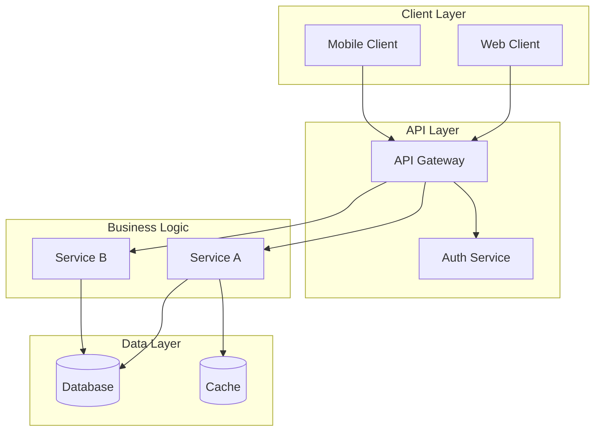
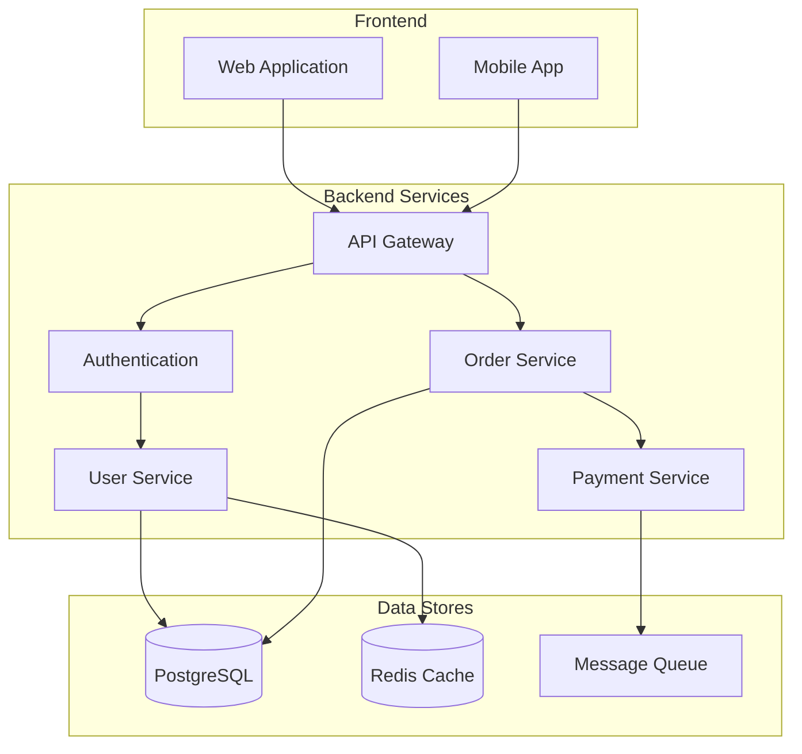
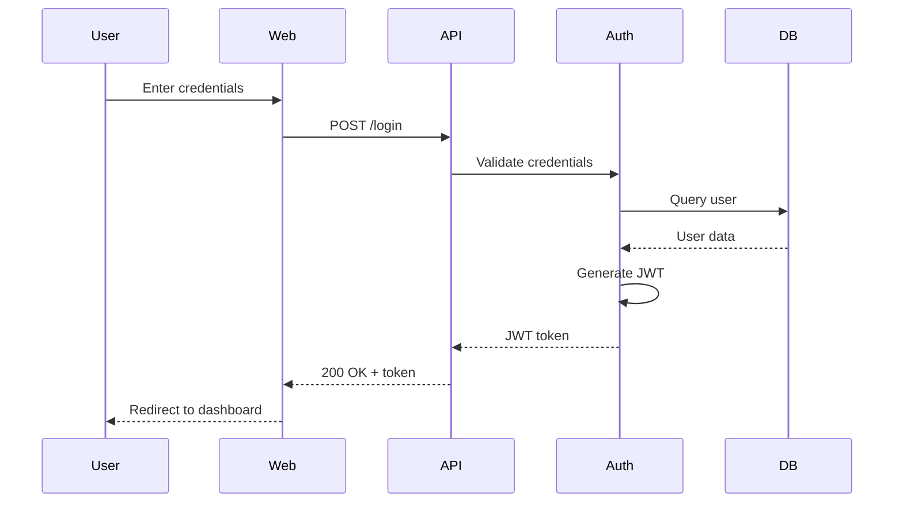
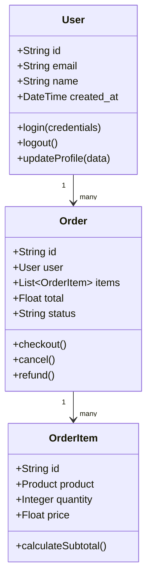
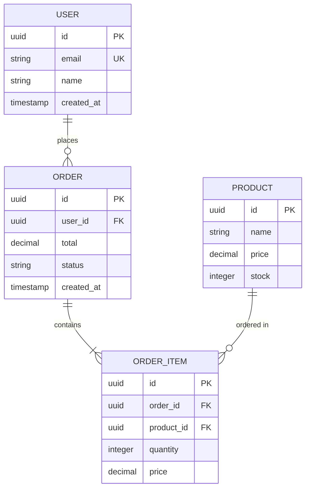

# Doc Generator Skill

Automated documentation generation workflow that analyzes codebases to create comprehensive README files, API documentation, architecture diagrams (Mermaid), user guides, and changelogs without manual intervention.

## Workflow

### 1. Analyze Project Structure

**Discover project layout**:

```bash
# Get high-level structure
tree -L 3 -I 'node_modules|__pycache__|.git|venv|dist|build' > structure.txt

# Identify project type and language
find . -name "package.json" -o -name "requirements.txt" -o -name "go.mod" -o -name "Cargo.toml"

# Find entry points
find . -name "main.py" -o -name "index.js" -o -name "main.go" -o -name "app.py"

# Locate configuration files
find . -name "*.config.js" -o -name "*.yaml" -o -name "*.json" -o -name ".env.example"
```

**Identify documentation needs**:
- What type of project? (library, service, CLI tool, web app)
- Who is the audience? (end users, developers, operators)
- What documentation exists? (README, docs folder, inline comments)
- What's missing? (API docs, architecture, setup guide)

**Gather metadata**:
- Project name (from package.json, setup.py, go.mod)
- Version number
- License type
- Dependencies
- Author/maintainer info

### 2. Generate README

**README structure template**:

```markdown
# [Project Name]

[One-sentence description extracted from package.json or docstring]

[](link)
[](LICENSE)
[](link)

## Overview

[2-3 paragraph description of what this project does, why it exists, and when to use it]

**Key Features:**
- [Feature 1 extracted from code analysis]
- [Feature 2]
- [Feature 3]

## Table of Contents

- [Installation](#installation)
- [Quick Start](#quick-start)
- [Usage](#usage)
- [API Reference](#api-reference)
- [Configuration](#configuration)
- [Architecture](#architecture)
- [Development](#development)
- [Contributing](#contributing)
- [License](#license)

## Installation

### Prerequisites

- [Runtime version] (e.g., Python 3.9+, Node 16+, Go 1.19+)
- [Database] (if applicable)
- [Other dependencies]

### Install via Package Manager

```bash
# Python
pip install [package-name]

# JavaScript/Node
npm install [package-name]

# Go
go get github.com/user/package
```

### Install from Source

```bash
git clone https://github.com/user/repo.git
cd repo

# Python
pip install -e .

# JavaScript
npm install

# Go
go build
```

## Quick Start

[Minimal working example extracted from tests or examples/]

```python
from package import main_function

# Basic usage
result = main_function(input_data)
print(result)
```

## Usage

### Basic Example

[Simple use case with explanation]

```python
# Code example with comments
```

### Advanced Example

[Complex use case showing advanced features]

```python
# More sophisticated example
```

### Configuration

[Configuration file format and options]

```yaml
# config.yaml example
option1: value1
option2: value2
```

**Configuration Options:**

| Option | Type | Default | Description |
|--------|------|---------|-------------|
| option1 | string | "default" | What it does |
| option2 | int | 100 | What it controls |

## API Reference

See [API.md](./docs/API.md) for complete API documentation.

### Main Classes/Functions

[Auto-generated from docstrings and type hints]

#### `function_name(param1: type, param2: type) -> return_type`

[Description from docstring]

**Parameters:**
- `param1` (type): Description
- `param2` (type): Description

**Returns:**
- type: Description

**Raises:**
- ExceptionType: When this happens

**Example:**
```python
result = function_name("value", 42)
```

## Architecture

[High-level architecture description]



### Components

- **Component A**: What it does
- **Component B**: What it does

### Data Flow

[Explain how data flows through the system]

## Development

### Setup Development Environment

```bash
# Clone repository
git clone https://github.com/user/repo.git
cd repo

# Create virtual environment (Python)
python -m venv venv
source venv/bin/activate  # or `venv\Scripts\activate` on Windows

# Install dependencies
pip install -r requirements-dev.txt  # or npm install, etc.

# Setup pre-commit hooks
pre-commit install
```

### Running Tests

```bash
# Python
pytest
pytest --cov=package tests/  # with coverage

# JavaScript
npm test
npm run test:coverage

# Go
go test ./...
go test -cover ./...
```

### Code Style

- Follow [style guide] (PEP 8, Airbnb, Go conventions)
- Use linters: `black`, `eslint`, `golangci-lint`
- Run formatter before commit: `make format`

### Building

```bash
# Build command based on project type
make build
# or npm run build
# or go build
```

### Contributing

See [CONTRIBUTING.md](./CONTRIBUTING.md) for guidelines.

**Quick Contribution Steps:**
1. Fork the repository
2. Create a feature branch: `git checkout -b feature-name`
3. Make your changes
4. Run tests: `make test`
5. Commit: `git commit -m "Add feature"`
6. Push: `git push origin feature-name`
7. Open a Pull Request

## Deployment

### Docker

```bash
# Build image
docker build -t app-name .

# Run container
docker run -p 8080:8080 app-name
```

### Production

[Production deployment instructions]

```bash
# Deployment commands
```

## Troubleshooting

### Common Issues

**Issue: [Error message]**
- **Cause**: Why this happens
- **Solution**: How to fix it

**Issue: [Another common problem]**
- **Cause**: Explanation
- **Solution**: Steps to resolve

## Performance

[If performance is important]

- Expected throughput: X requests/second
- Latency: p95 < Xms
- Resource usage: Y CPU, Z memory

## Security

[Security considerations if applicable]

- Authentication: How it works
- Authorization: Access control model
- Data encryption: What's encrypted

## License

[License type from LICENSE file]

Copyright (c) [Year] [Author]

## Support

- **Documentation**: https://docs.example.com
- **Issues**: https://github.com/user/repo/issues
- **Discussions**: https://github.com/user/repo/discussions
- **Email**: support@example.com
- **Slack/Discord**: [Community link]

## Acknowledgments

- [Credits to contributors, libraries, inspiration]

## Changelog

See [CHANGELOG.md](./CHANGELOG.md) for version history.
```

### 3. Generate API Documentation

**Extract from code**:

```bash
# Python - find all public functions and classes
grep -r "^def\|^class" --include="*.py" src/ | grep -v "^_"

# JavaScript - find exports
grep -r "^export" --include="*.js" --include="*.ts" src/

# Go - find exported functions (capitalized)
grep -r "^func [A-Z]" --include="*.go" pkg/
```

**Parse docstrings/comments**:

For Python:
```python
def calculate_discount(price: float, discount_rate: float) -> float:
    """Calculate discounted price.

    Applies a percentage discount to the given price.

    Args:
        price: Original price in dollars
        discount_rate: Discount percentage as decimal (0.0 to 1.0)

    Returns:
        Discounted price rounded to 2 decimal places

    Raises:
        ValueError: If price is negative or discount_rate is not in [0, 1]

    Examples:
        >>> calculate_discount(100.0, 0.2)
        80.0
    """
```

**Generate API.md**:

```markdown
# API Reference

## Table of Contents

- [Classes](#classes)
  - [ClassName](#classname)
- [Functions](#functions)
  - [function_name](#function_name)
- [Types](#types)
- [Constants](#constants)

## Classes

### ClassName

[Description from class docstring]

#### Methods

##### `method_name(param: type) -> return_type`

[Description]

**Parameters:**
- `param` (type): Description

**Returns:**
- type: Description

**Example:**
```python
obj = ClassName()
result = obj.method_name(value)
```

## Functions

### `function_name(param1: type, param2: type) -> return_type`

[Description from docstring]

**Parameters:**
- `param1` (type): Description
- `param2` (type): Description

**Returns:**
- type: Description

**Raises:**
- ExceptionType: When this occurs

**Example:**
```python
result = function_name(arg1, arg2)
```

## Types

### TypeName

[TypeScript interface or Python TypedDict definition]

```typescript
interface TypeName {
  field1: string;
  field2: number;
  field3?: boolean;
}
```

## Constants

### CONSTANT_NAME

**Type:** string
**Value:** "value"
**Description:** What this constant represents
```

### 4. Generate Architecture Diagrams

**System architecture**:



**Sequence diagrams for key flows**:



**Class/component diagrams**:



**Database ERD**:



### 5. Generate User Guide

**User guide structure**:

```markdown
# User Guide

## Getting Started

### Installation

[Step-by-step installation instructions]

### First-Time Setup

[Initial configuration steps]

### Your First [Action]

[Tutorial for main use case]

## Core Concepts

### Concept 1

[Explanation of key concept]

### Concept 2

[Another important concept]

## How-To Guides

### How to [Task 1]

[Step-by-step guide]

1. Step 1
2. Step 2
3. Step 3

### How to [Task 2]

[Another common task]

## Best Practices

- [Best practice 1]
- [Best practice 2]
- [Best practice 3]

## Common Workflows

### Workflow A: [Name]

[Description of complete workflow]

```bash
# Commands to execute
```

### Workflow B: [Name]

[Another end-to-end workflow]

## Tips and Tricks

- **Tip 1**: [Useful shortcut or pattern]
- **Tip 2**: [Another helpful tip]

## FAQ

**Q: [Common question]?**
A: [Answer]

**Q: [Another question]?**
A: [Answer]
```

### 6. Generate Changelog

**Parse git history**:

```bash
# Get commits since last release
git log v1.0.0..HEAD --pretty=format:"%h %s" --no-merges

# Group by type (feat, fix, docs, etc.)
git log v1.0.0..HEAD --pretty=format:"%s" | grep "^feat:" | sed 's/^feat: /- /'
git log v1.0.0..HEAD --pretty=format:"%s" | grep "^fix:" | sed 's/^fix: /- /'
```

**CHANGELOG.md format**:

```markdown
# Changelog

All notable changes to this project will be documented in this file.

The format is based on [Keep a Changelog](https://keepachangelog.com/en/1.0.0/),
and this project adheres to [Semantic Versioning](https://semver.org/spec/v2.0.0.html).

## [Unreleased]

### Added
- [Feature from git commits with 'feat:' prefix]

### Changed
- [Changes from commits with 'refactor:' or 'change:']

### Fixed
- [Fixes from commits with 'fix:' prefix]

### Security
- [Security fixes]

## [1.1.0] - 2026-01-12

### Added
- New API endpoint for user preferences
- Support for batch operations
- Configuration validation on startup

### Changed
- Improved error messages for validation failures
- Updated dependencies to latest versions
- Migrated from SQLite to PostgreSQL

### Deprecated
- `old_function()` in favor of `new_function()`

### Removed
- Support for Python 3.7 (end of life)

### Fixed
- Race condition in cache invalidation
- Memory leak in long-running workers
- Incorrect timezone handling in reports

### Security
- Fixed SQL injection vulnerability in search
- Updated jwt library to patch CVE-2024-XXXX

## [1.0.0] - 2025-12-01

### Added
- Initial release
- Core API functionality
- User authentication
- Basic CRUD operations

[Unreleased]: https://github.com/user/repo/compare/v1.1.0...HEAD
[1.1.0]: https://github.com/user/repo/compare/v1.0.0...v1.1.0
[1.0.0]: https://github.com/user/repo/releases/tag/v1.0.0
```

### 7. Generate Contributing Guide

**CONTRIBUTING.md template**:

```markdown
# Contributing to [Project Name]

Thank you for your interest in contributing! This guide will help you get started.

## Code of Conduct

This project adheres to a Code of Conduct. By participating, you are expected to uphold this code.

## How Can I Contribute?

### Reporting Bugs

Before creating a bug report:
- Check existing issues to avoid duplicates
- Collect relevant information (version, OS, error messages)

**Bug Report Template:**
- Description of the bug
- Steps to reproduce
- Expected behavior
- Actual behavior
- Screenshots (if applicable)
- Environment details

### Suggesting Features

Feature requests are welcome! Please:
- Explain the use case
- Describe proposed solution
- Consider alternative approaches

### Pull Requests

1. Fork the repository
2. Create a feature branch: `git checkout -b feature/amazing-feature`
3. Make your changes
4. Write/update tests
5. Run tests: `make test`
6. Run linter: `make lint`
7. Commit your changes: `git commit -m 'Add amazing feature'`
8. Push to branch: `git push origin feature/amazing-feature`
9. Open a Pull Request

**PR Guidelines:**
- Link related issues
- Update documentation
- Add tests for new features
- Follow code style guidelines
- Keep changes focused

## Development Setup

[From README installation section]

## Code Style

- [Language style guide]
- Use provided linter configs
- Run `make format` before committing

## Testing

- Write tests for new features
- Maintain >80% code coverage
- Run full test suite before PR

## Commit Messages

Follow [Conventional Commits](https://www.conventionalcommits.org/):

```
type(scope): subject

body

footer
```

**Types:**
- `feat`: New feature
- `fix`: Bug fix
- `docs`: Documentation
- `style`: Formatting
- `refactor`: Code restructuring
- `test`: Adding tests
- `chore`: Maintenance

## Review Process

1. Automated checks must pass
2. Code review by maintainer
3. Address feedback
4. Merge when approved

## Getting Help

- Check documentation
- Search existing issues
- Ask in discussions
- Join community chat
```

### 8. Auto-Generate Missing Sections

**Analyze codebase to fill gaps**:

```bash
# Find example files for Quick Start
find . -path "*/examples/*" -o -path "*/demo/*" | head -5

# Find test files for usage examples
find . -path "*/tests/*" -name "test_*.py" -o -name "*.test.js" | head -5

# Find config examples
find . -name "*.example.*" -o -name "*.sample.*"

# Scan for inline documentation
find . -name "*.md" -not -path "*/node_modules/*" -not -path "*/.git/*"
```

**Extract code examples from tests**:

```python
# tests/test_user.py
def test_create_user():
    user = User(email="test@example.com", name="Test User")
    user.save()
    assert user.id is not None

# This becomes a Quick Start example
```

**Generate configuration documentation**:

```bash
# Find config schema or validation
grep -r "config\|settings\|options" --include="*.py" --include="*.js"

# Parse config structure to document options
```

### 9. Validate and Polish

**Check documentation quality**:

```bash
# Check for broken links
find . -name "*.md" -exec markdown-link-check {} \;

# Spell check
aspell list < README.md

# Verify code examples execute
# Extract code blocks and run them
```

**Ensure consistency**:
- All code examples use same style
- Links work (internal and external)
- Version numbers match across files
- Formatting is consistent

**Review completeness**:
- [ ] README covers all major features
- [ ] API docs for all public functions
- [ ] Architecture diagram shows all components
- [ ] User guide has clear examples
- [ ] Contributing guide has setup steps
- [ ] Changelog is up to date

## Best Practices

### Documentation Principles

- **DRY (Don't Repeat Yourself)**: Link to canonical sources
- **KISS (Keep It Simple)**: Clear, concise language
- **Show, Don't Tell**: Use examples liberally
- **Maintain**: Update docs with code changes
- **Test**: Verify code examples work

### Writing Style

- Use active voice
- Write in present tense
- Be specific and concrete
- Avoid jargon or explain it
- Use formatting (headings, lists, code blocks)

### Organization

- Start with quickstart
- Progress from simple to complex
- Group related information
- Use clear headings and TOC
- Cross-reference related sections

### Code Examples

- Keep examples minimal
- Show realistic use cases
- Include expected output
- Comment non-obvious code
- Test all examples

## Tools

### Documentation Generators

- **Python**: Sphinx, MkDocs, pdoc3
- **JavaScript**: JSDoc, TypeDoc, Docusaurus
- **Go**: godoc, pkgsite
- **OpenAPI**: Swagger, Redoc

### Diagram Tools

- **Mermaid**: Text-based diagrams in Markdown
- **PlantUML**: UML diagrams from text
- **Draw.io**: Visual diagram editor
- **Excalidraw**: Hand-drawn style diagrams

### Documentation Hosting

- **GitHub Pages**: Free static site hosting
- **Read the Docs**: Auto-build from git
- **Netlify/Vercel**: Modern hosting platforms
- **GitBook**: Documentation platform

## Common Pitfalls

- Documenting after code is done (document as you build)
- Assuming knowledge (explain everything)
- Not providing examples
- Letting docs get stale
- Inconsistent formatting
- Missing prerequisites
- No troubleshooting section
- Broken links

## Output Files

This skill generates:

1. **README.md**: Main project documentation
2. **docs/API.md**: Complete API reference
3. **docs/ARCHITECTURE.md**: System architecture
4. **docs/USER_GUIDE.md**: End-user documentation
5. **CHANGELOG.md**: Version history
6. **CONTRIBUTING.md**: Contribution guidelines
7. **docs/diagrams/**: Mermaid diagram files

## Collaboration

Works well with:
- **document skill**: For inline code documentation
- **design-api skill**: For API design documentation
- **plan-architecture skill**: For architecture diagrams
- **review-code skill**: For ensuring code is documented
- **add-tests skill**: For extracting usage examples from tests
