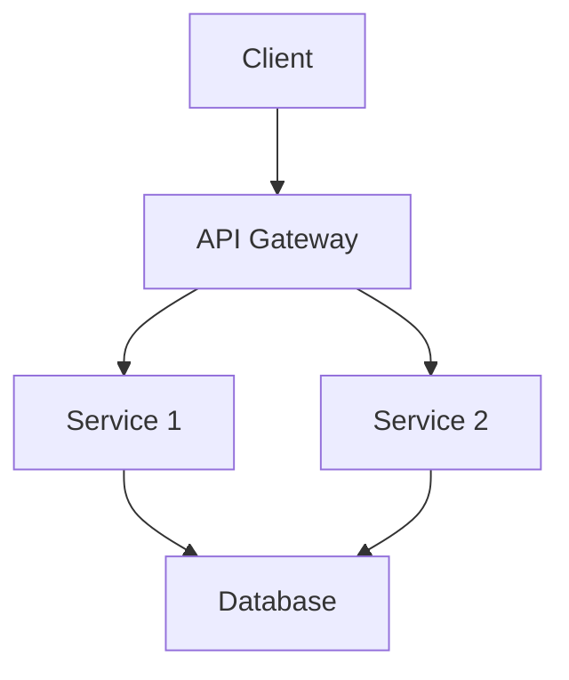
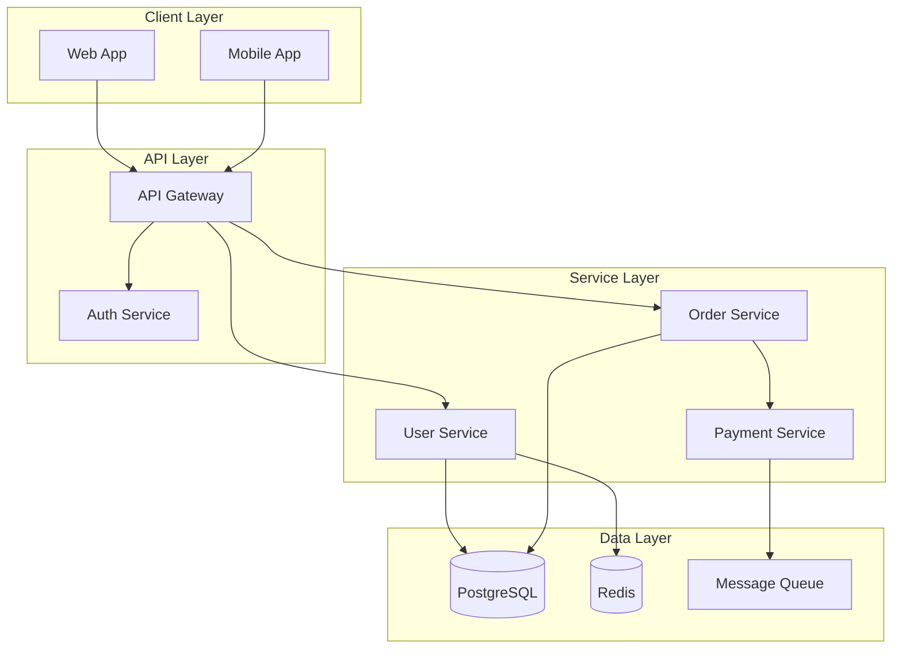
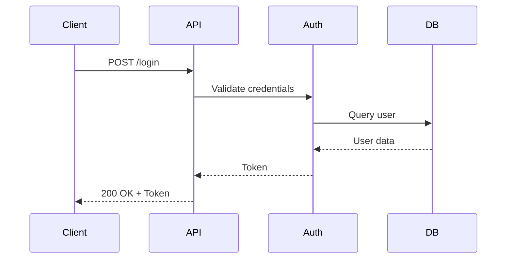
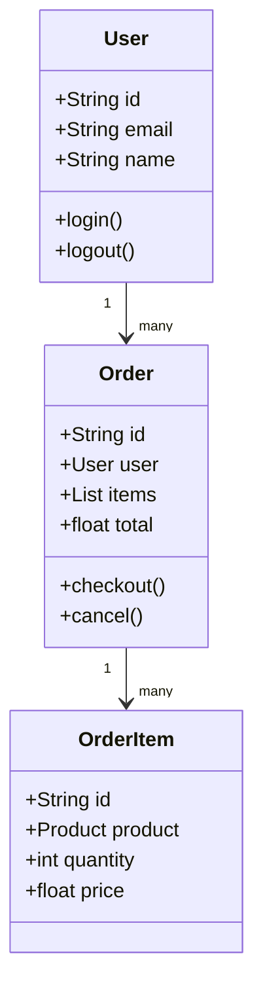
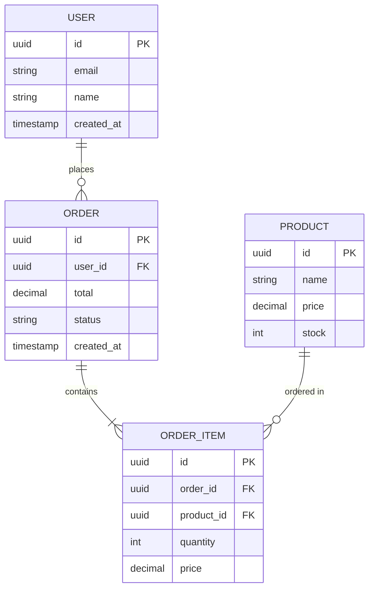

# Document Skill

Comprehensive documentation generation workflow that creates README files, API documentation, inline comments, architecture diagrams (Mermaid), and runbooks by analyzing code structure.

## Workflow

### 1. Analyze Code Structure

**Identify documentation scope**:
- What needs documentation? (API, library, service, tool)
- Who is the audience? (developers, users, ops team)
- What level of detail? (reference, tutorial, guide)

**Gather information**:
```bash
# List project structure
tree -L 3 -I 'node_modules|__pycache__|.git'

# Find main entry points
grep -r "def main\|if __name__\|func main" --include="*.py" --include="*.go"

# Find exported functions/classes
grep -r "^export\|^class\|^def " --include="*.js" --include="*.py"

# Check existing documentation
find . -name "README*" -o -name "*.md" | head -20
```

### 2. Create/Update README

A good README includes:

#### Template

```markdown
# Project Name

Brief one-sentence description of what this project does.

## Overview

A paragraph explaining:
- What problem this solves
- Key features
- When to use this

## Installation

### Requirements
- Python 3.9+ / Node 16+ / Go 1.19+
- Dependencies (list major ones)

### Install
```bash
# Package manager install
pip install package-name
npm install package-name
go get github.com/user/package
```

OR

```bash
# From source
git clone https://github.com/user/repo.git
cd repo
pip install -e .  # or npm install, or go build
```

## Quick Start

```python
# Minimal example showing basic usage
from package import main_function

result = main_function(input_data)
print(result)
```

## Usage

### Basic Example
```python
# More detailed example with explanation
```

### Advanced Example
```python
# Complex use case
```

### Configuration
```yaml
# Configuration file example
```

## API Reference

See [API.md](./API.md) for complete API documentation.

### Main Functions

#### `function_name(param1, param2)`
Description of what it does.

**Parameters:**
- `param1` (type): Description
- `param2` (type): Description

**Returns:**
- type: Description

**Example:**
```python
result = function_name("value1", 42)
```

## Architecture

High-level architecture overview. Consider adding a diagram:



## Development

### Setup Development Environment
```bash
# Clone and setup
git clone ...
cd repo
make setup  # or equivalent
```

### Running Tests
```bash
pytest
npm test
go test ./...
```

### Code Style
- Follow PEP8 / Airbnb style guide / Go conventions
- Use linters: black, eslint, golangci-lint

### Contributing
See [CONTRIBUTING.md](./CONTRIBUTING.md)

## Deployment

### Docker
```bash
docker build -t app .
docker run -p 8080:8080 app
```

### Production
```bash
# Deployment instructions
```

## Troubleshooting

### Common Issues

**Issue: Error message**
- Cause: Explanation
- Solution: Fix steps

## License

MIT License (or your license)

## Support

- Documentation: https://docs.example.com
- Issues: https://github.com/user/repo/issues
- Email: support@example.com
```

### 3. Generate API Documentation

#### Python (Docstrings)

```python
def calculate_discount(price: float, discount_rate: float) -> float:
    """Calculate discounted price.

    Applies a percentage discount to the given price.

    Args:
        price: Original price in dollars
        discount_rate: Discount percentage as decimal (0.0 to 1.0)

    Returns:
        Discounted price rounded to 2 decimal places

    Raises:
        ValueError: If price is negative or discount_rate is not in [0, 1]

    Examples:
        >>> calculate_discount(100.0, 0.2)
        80.0
        >>> calculate_discount(50.0, 0.1)
        45.0
    """
    if price < 0:
        raise ValueError("Price cannot be negative")
    if not 0 <= discount_rate <= 1:
        raise ValueError("Discount rate must be between 0 and 1")

    discount_amount = price * discount_rate
    return round(price - discount_amount, 2)
```

**Generate HTML docs**:
```bash
# Sphinx
sphinx-apidoc -o docs/ src/
cd docs && make html

# pdoc
pdoc --html --output-dir docs/ src/
```

#### JavaScript (JSDoc)

```javascript
/**
 * Calculate discounted price
 *
 * Applies a percentage discount to the given price.
 *
 * @param {number} price - Original price in dollars
 * @param {number} discountRate - Discount percentage as decimal (0.0 to 1.0)
 * @returns {number} Discounted price rounded to 2 decimal places
 * @throws {Error} If price is negative or discountRate is not in [0, 1]
 *
 * @example
 * calculateDiscount(100.0, 0.2)
 * // returns 80.0
 *
 * @example
 * calculateDiscount(50.0, 0.1)
 * // returns 45.0
 */
function calculateDiscount(price, discountRate) {
  if (price < 0) {
    throw new Error('Price cannot be negative');
  }
  if (discountRate < 0 || discountRate > 1) {
    throw new Error('Discount rate must be between 0 and 1');
  }

  const discountAmount = price * discountRate;
  return Math.round((price - discountAmount) * 100) / 100;
}
```

**Generate HTML docs**:
```bash
# JSDoc
jsdoc src/ -d docs/

# TypeDoc (for TypeScript)
typedoc --out docs src/
```

#### Go (Godoc)

```go
// Package discount provides utilities for price calculations.
package discount

import "errors"

// CalculateDiscount applies a percentage discount to a price.
//
// The discountRate should be a decimal between 0.0 and 1.0.
// Returns the discounted price rounded to 2 decimal places.
//
// Example:
//   discounted := CalculateDiscount(100.0, 0.2)  // returns 80.0
func CalculateDiscount(price, discountRate float64) (float64, error) {
    if price < 0 {
        return 0, errors.New("price cannot be negative")
    }
    if discountRate < 0 || discountRate > 1 {
        return 0, errors.New("discount rate must be between 0 and 1")
    }

    discountAmount := price * discountRate
    return math.Round((price-discountAmount)*100) / 100, nil
}
```

**View docs**:
```bash
godoc -http=:6060
# Navigate to http://localhost:6060/pkg/your/package/
```

### 4. Add Inline Comments

**When to comment**:
- Complex algorithms
- Non-obvious business logic
- Workarounds for bugs
- Performance optimizations
- Security considerations
- TODOs and FIXMEs

**When NOT to comment**:
- Obvious code (what)
- Redundant comments that repeat code

**Good comments explain WHY, not WHAT**:

```python
# Bad: Comment explains what (obvious from code)
# Increment counter by 1
counter += 1

# Good: Comment explains why (business logic)
# Include pending orders in count for inventory allocation
counter += pending_orders.count()

# Good: Comment explains non-obvious optimization
# Use binary search instead of linear to handle large datasets (>100k items)
index = bisect.bisect_left(sorted_items, target)

# Good: Comment explains workaround
# FIXME: API sometimes returns null instead of empty array
# Remove this check when API v2 is deployed
items = response.get('items') or []
```

### 5. Create Architecture Diagrams

#### Mermaid Diagrams

**System Architecture**:


**Sequence Diagram**:


**Class Diagram**:


**Entity Relationship Diagram**:


### 6. Create Runbooks

Runbooks document operational procedures.

#### Deployment Runbook

```markdown
# Deployment Runbook

## Pre-Deployment Checklist

- [ ] All tests passing in CI
- [ ] Code reviewed and approved
- [ ] Database migrations tested
- [ ] Rollback plan prepared
- [ ] Monitoring alerts configured
- [ ] Stakeholders notified

## Deployment Steps

### 1. Backup Database
```bash
pg_dump -h prod-db -U admin app_db > backup_$(date +%Y%m%d_%H%M%S).sql
```

### 2. Run Migrations
```bash
cd /opt/app
./manage.py migrate --check  # Dry run
./manage.py migrate           # Execute
```

### 3. Deploy Application
```bash
# Blue-green deployment
kubectl apply -f k8s/deployment-green.yaml
kubectl rollout status deployment/app-green

# Switch traffic
kubectl patch service app -p '{"spec":{"selector":{"version":"green"}}}'
```

### 4. Verify Deployment
```bash
# Health check
curl https://app.example.com/health

# Smoke tests
./scripts/smoke-tests.sh

# Check metrics
open https://grafana.example.com/d/app-dashboard
```

### 5. Monitor
- Watch error rates in Sentry
- Monitor response times in Datadog
- Check logs: `kubectl logs -f deployment/app-green`

## Rollback Procedure

If deployment fails:

```bash
# Switch back to blue
kubectl patch service app -p '{"spec":{"selector":{"version":"blue"}}}'

# Rollback migration (if needed)
./manage.py migrate app <previous_migration>

# Verify rollback
curl https://app.example.com/health
```

## Post-Deployment

- [ ] Verify all metrics normal
- [ ] Update deployment log
- [ ] Notify stakeholders of completion
- [ ] Schedule blue cleanup for +24h
```

#### Incident Response Runbook

```markdown
# Incident Response Runbook

## Severity Levels

- **SEV1**: Complete outage, data loss, security breach
- **SEV2**: Major feature down, significant degradation
- **SEV3**: Minor feature issue, workaround available

## SEV1 Response Procedure

### 1. Alert (0-5 min)
- Page on-call engineer
- Create incident channel: #incident-YYYYMMDD-description
- Post in #incidents: "SEV1: Description"

### 2. Assess (5-10 min)
- What is broken?
- How many users affected?
- Is data at risk?
- Document timeline

### 3. Mitigate (10-30 min)
- Apply immediate fix or rollback
- Prioritize recovery over diagnosis
- Keep incident channel updated

### 4. Verify (30-45 min)
- Confirm issue resolved
- Check metrics returned to normal
- Test key user flows

### 5. Communicate (ongoing)
- Update status page
- Notify affected customers
- Post-mortem scheduled

## Common Issues

### Database Connection Pool Exhausted
**Symptoms**: 500 errors, "Too many connections"
**Diagnosis**: `SHOW PROCESSLIST;`
**Fix**:
```bash
# Restart app servers to reset connections
kubectl rollout restart deployment/app

# Or increase pool size
kubectl set env deployment/app DB_POOL_SIZE=50
```

### Memory Leak
**Symptoms**: Increasing memory, eventual OOM crash
**Diagnosis**: `kubectl top pods`
**Fix**:
```bash
# Restart affected pods
kubectl delete pod <pod-name>

# Schedule rolling restart
kubectl rollout restart deployment/app
```
```

### 7. Generate OpenAPI/Swagger Documentation

For REST APIs:

```yaml
openapi: 3.0.0
info:
  title: User API
  version: 1.0.0
  description: API for user management

servers:
  - url: https://api.example.com/v1

paths:
  /users:
    get:
      summary: List users
      parameters:
        - name: limit
          in: query
          schema:
            type: integer
            default: 10
      responses:
        '200':
          description: Successful response
          content:
            application/json:
              schema:
                type: array
                items:
                  $ref: '#/components/schemas/User'

    post:
      summary: Create user
      requestBody:
        required: true
        content:
          application/json:
            schema:
              $ref: '#/components/schemas/UserCreate'
      responses:
        '201':
          description: User created
          content:
            application/json:
              schema:
                $ref: '#/components/schemas/User'

components:
  schemas:
    User:
      type: object
      properties:
        id:
          type: string
          format: uuid
        email:
          type: string
          format: email
        name:
          type: string
        created_at:
          type: string
          format: date-time

    UserCreate:
      type: object
      required:
        - email
        - name
      properties:
        email:
          type: string
          format: email
        name:
          type: string
```

**Generate from code**:
```bash
# Python (FastAPI)
# Automatically generates OpenAPI at /docs

# JavaScript (Express)
npm install swagger-jsdoc swagger-ui-express

# Go
go install github.com/swaggo/swag/cmd/swag@latest
swag init
```

## Documentation Best Practices

### Writing Style

- **Be concise**: Get to the point
- **Use examples**: Show, don't just tell
- **Be accurate**: Test all examples
- **Keep updated**: Docs rot quickly
- **Use proper formatting**: Code blocks, headings, lists
- **Link related docs**: Help users navigate

### Structure

- **Start simple**: Quick start before detailed docs
- **Logical flow**: Installation → Usage → Advanced → API
- **Searchable**: Good headings, keywords
- **Versioned**: Document version-specific behavior

### Maintenance

- **Review with code changes**: Update docs in same PR
- **Schedule audits**: Quarterly doc review
- **Fix broken links**: Use link checkers
- **Gather feedback**: "Was this helpful?" buttons

## Tools

### Documentation Generators

- **Python**: Sphinx, MkDocs, pdoc
- **JavaScript**: JSDoc, TypeDoc, Docusaurus
- **Go**: godoc
- **Multi-language**: Doxygen

### Diagram Tools

- **Mermaid**: Text-based diagrams in Markdown
- **PlantUML**: Text-based UML diagrams
- **Draw.io**: Visual diagram editor
- **Lucidchart**: Collaborative diagramming

### API Documentation

- **Swagger/OpenAPI**: REST API specification
- **Postman**: API documentation and testing
- **GraphQL**: Built-in schema documentation
- **grpcurl**: gRPC API documentation

## Common Pitfalls

- Writing documentation after code is done (write as you code)
- Over-documenting obvious code
- Under-documenting complex logic
- Letting docs get out of sync with code
- Not providing examples
- Using jargon without explanation
- Missing error handling documentation
