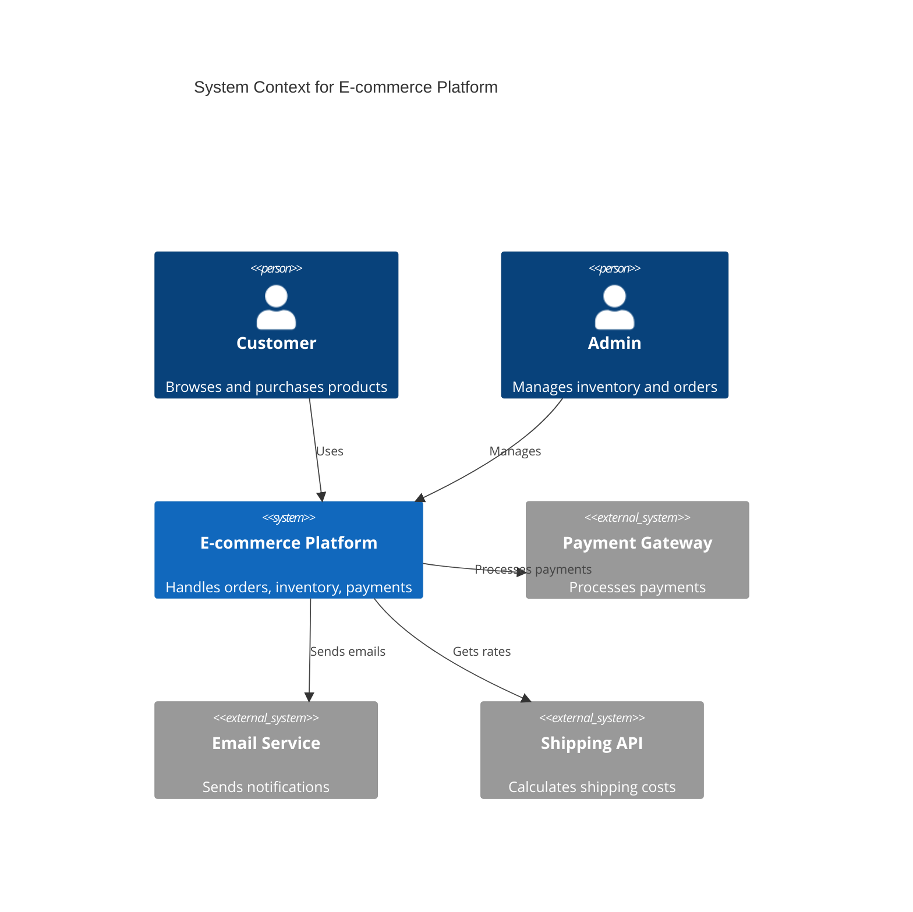
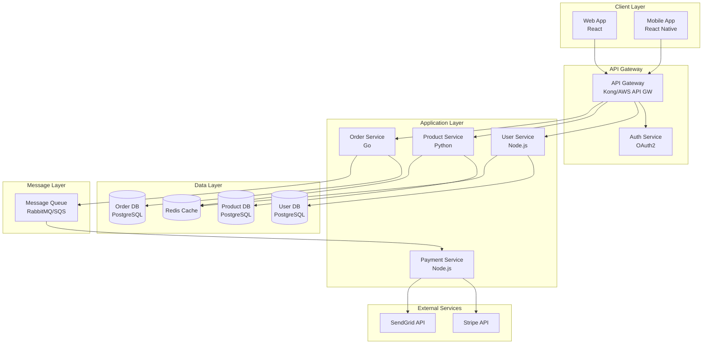
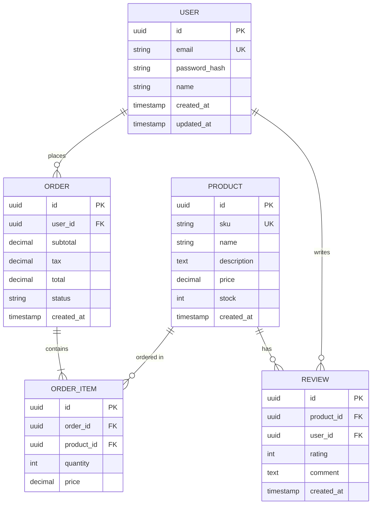
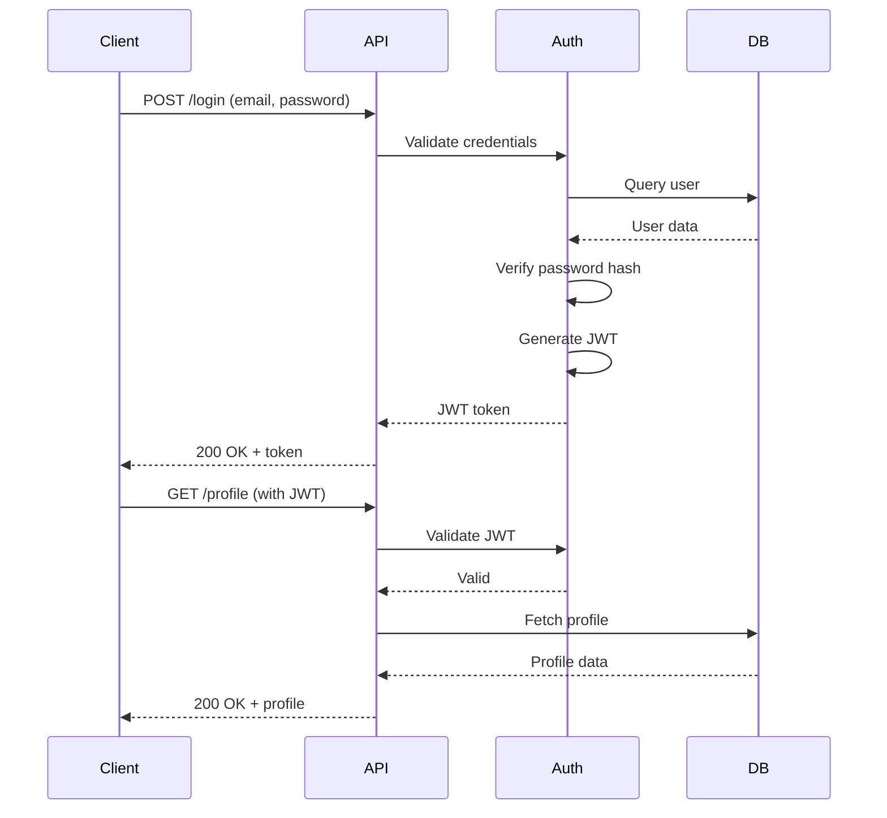

# Plan Architecture Skill

Architecture planning workflow that analyzes requirements, proposes system design, creates diagrams, identifies components, documents technical decisions, considers trade-offs, and generates Architecture Decision Records (ADRs).

## Workflow

### 1. Gather Requirements

**Functional requirements**:
- What does the system need to do?
- What are the core features?
- What are the user workflows?

**Non-functional requirements**:
- **Performance**: Latency, throughput, response time targets
- **Scalability**: Expected growth, peak load
- **Availability**: Uptime requirements (99.9%, 99.99%?)
- **Reliability**: Failure tolerance, data durability
- **Security**: Authentication, authorization, data protection
- **Compliance**: GDPR, HIPAA, SOC 2, etc.

**Constraints**:
- **Budget**: Cost limits
- **Timeline**: Delivery deadlines
- **Team skills**: Technology familiarity
- **Existing systems**: Integration requirements
- **Technology**: Mandated tech stack

**Questions to ask**:
```
- How many users? (now and in 2 years)
- What's the expected data volume?
- What are the critical user flows?
- What's the acceptable downtime?
- What's the budget for infrastructure?
- Are there compliance requirements?
- What existing systems need integration?
```

### 2. Define System Context

**Create context diagram**:



### 3. Design High-Level Architecture

**Choose architecture style**:

**Monolith**:
- Pros: Simple deployment, easy local dev, single codebase
- Cons: Scaling all-or-nothing, tight coupling
- Good for: Small teams, MVP, simple apps

**Microservices**:
- Pros: Independent scaling, technology flexibility, team autonomy
- Cons: Operational complexity, distributed system challenges
- Good for: Large teams, complex domains, high scale

**Serverless**:
- Pros: Auto-scaling, pay-per-use, minimal ops
- Cons: Cold starts, vendor lock-in, debugging harder
- Good for: Event-driven, variable load, small teams

**Event-driven**:
- Pros: Loose coupling, async processing, scalable
- Cons: Eventual consistency, harder to debug
- Good for: Real-time, high-throughput, decoupled services

**Architecture diagram example**:



### 4. Design Components

For each major component, define:

**User Service**:
```
Responsibilities:
- User registration and authentication
- Profile management
- Session management

Technology: Node.js + Express
Database: PostgreSQL
Caching: Redis

APIs:
- POST /auth/register
- POST /auth/login
- GET /users/:id
- PUT /users/:id
- DELETE /users/:id

Dependencies:
- Auth Service (for JWT validation)
- Redis (for sessions)
- Email Service (for verification)

Scaling:
- Horizontal scaling (stateless)
- Read replicas for database
- Redis cluster for sessions
```

### 5. Design Data Model

**Entity Relationship Diagram**:



**Choose database**:

**PostgreSQL/MySQL**:
- Use for: Relational data, ACID transactions, complex queries
- Scaling: Read replicas, sharding

**MongoDB**:
- Use for: Flexible schema, nested documents, rapid iteration
- Scaling: Horizontal sharding

**Cassandra**:
- Use for: Time-series data, high write throughput
- Scaling: Built-in distribution

**Redis**:
- Use for: Caching, sessions, real-time data
- Scaling: Cluster mode

### 6. Design APIs

**REST API example**:

```yaml
openapi: 3.0.0
info:
  title: E-commerce API
  version: 1.0.0

paths:
  /products:
    get:
      summary: List products
      parameters:
        - name: category
          in: query
          schema:
            type: string
        - name: limit
          in: query
          schema:
            type: integer
            default: 20
      responses:
        '200':
          description: List of products
          content:
            application/json:
              schema:
                type: array
                items:
                  $ref: '#/components/schemas/Product'

  /orders:
    post:
      summary: Create order
      requestBody:
        required: true
        content:
          application/json:
            schema:
              $ref: '#/components/schemas/CreateOrder'
      responses:
        '201':
          description: Order created
          content:
            application/json:
              schema:
                $ref: '#/components/schemas/Order'

components:
  schemas:
    Product:
      type: object
      properties:
        id:
          type: string
          format: uuid
        name:
          type: string
        price:
          type: number
        stock:
          type: integer
```

**GraphQL alternative**:

```graphql
type Query {
  products(category: String, limit: Int = 20): [Product!]!
  product(id: ID!): Product
  order(id: ID!): Order
}

type Mutation {
  createOrder(input: CreateOrderInput!): Order!
  updateProduct(id: ID!, input: UpdateProductInput!): Product!
}

type Product {
  id: ID!
  name: String!
  description: String
  price: Float!
  stock: Int!
  reviews: [Review!]!
}

type Order {
  id: ID!
  user: User!
  items: [OrderItem!]!
  total: Float!
  status: OrderStatus!
  createdAt: DateTime!
}
```

### 7. Consider Trade-offs

**Document key decisions**:

**CAP Theorem**:
- **Consistency**: All nodes see same data
- **Availability**: Every request gets response
- **Partition tolerance**: System works despite network issues

Choose 2 of 3:
- **CP**: Strong consistency (PostgreSQL, MongoDB)
- **AP**: High availability (Cassandra, DynamoDB)

**Eventual consistency vs Strong consistency**:
- Eventual: Better performance, may see stale data
- Strong: Always current data, slower, harder to scale

**Sync vs Async**:
- Sync: Immediate response, simpler, can be slow
- Async: Better performance, more complex, eventual processing

**Monolith vs Microservices**:
- Monolith: Simpler, faster development initially
- Microservices: Better scaling, more operational overhead

### 8. Plan for Scale

**Horizontal scaling**:
```
Load Balancer
    ↓
App Server 1
App Server 2
App Server 3
    ↓
Database (with read replicas)
```

**Caching strategy**:
```
Cache-aside pattern:
1. Check cache
2. If miss, fetch from DB
3. Store in cache
4. Return to client
```

**Database sharding**:
```
Users 1-1M → Shard 1
Users 1M-2M → Shard 2
Users 2M-3M → Shard 3
```

**CDN for static assets**:
```
User → CDN (images, CSS, JS) → Origin Server
```

### 9. Security Architecture

**Authentication flow**:



**Security layers**:
- **Network**: VPC, security groups, firewall
- **Transport**: TLS/HTTPS everywhere
- **Application**: Input validation, output encoding
- **Authentication**: OAuth2, JWT, MFA
- **Authorization**: RBAC, attribute-based access control
- **Data**: Encryption at rest and in transit

### 10. Create ADRs (Architecture Decision Records)

**ADR Template**:

```markdown
# ADR-001: Use PostgreSQL for Primary Database

## Status
Accepted

## Context
We need to choose a database for our e-commerce platform. Requirements:
- Strong consistency for order and payment data
- Complex relational queries (joins across users, orders, products)
- ACID transactions
- Mature ecosystem and tooling
- Team has SQL experience

Options considered:
1. PostgreSQL
2. MySQL
3. MongoDB

## Decision
We will use PostgreSQL as our primary database.

## Rationale

**Why PostgreSQL over MySQL**:
- Better support for JSON data types (for flexible product attributes)
- More advanced indexing options (GiST, GIN)
- Better concurrent write performance
- Superior full-text search

**Why PostgreSQL over MongoDB**:
- We need strong consistency for financial transactions
- Our data model is highly relational
- We need complex joins and aggregations
- Team more familiar with SQL

## Consequences

**Positive**:
- Strong ACID guarantees for critical transactions
- Rich SQL features for complex queries
- Excellent tooling and extensions (PostGIS, pg_stat_statements)
- Good performance for our scale (up to 10M users)

**Negative**:
- Vertical scaling has limits (will need read replicas)
- Schema migrations require planning
- Eventual need for sharding if we exceed single-server capacity

**Neutral**:
- Need to set up backup and replication strategy
- Need to monitor and tune query performance
- Will use Redis for caching to reduce DB load

## Implementation
- Use PostgreSQL 14+
- Set up primary with 2 read replicas
- Use connection pooling (PgBouncer)
- Regular backups to S3
- Monitoring with pg_stat_statements

## Alternatives Considered
See context section above.

## Notes
Decision made: 2024-01-15
Contributors: @architect, @tech-lead, @dba

## Related Decisions
- ADR-002: Use Redis for caching
- ADR-003: Use RDS for managed PostgreSQL
```

### 11. Document Architecture

Create architecture documentation:

```markdown
# E-commerce Platform Architecture

## Overview
Microservices-based e-commerce platform with REST APIs.

## Architecture Style
- **Style**: Microservices
- **Communication**: REST + Async messaging
- **Data**: Polyglot persistence
- **Deployment**: Kubernetes on AWS EKS

## Components

### User Service
- **Responsibility**: User auth and profile management
- **Tech**: Node.js + Express
- **Database**: PostgreSQL
- **APIs**: /auth/*, /users/*

### Product Service
- **Responsibility**: Product catalog
- **Tech**: Python + FastAPI
- **Database**: PostgreSQL + Redis cache
- **APIs**: /products/*, /categories/*

### Order Service
- **Responsibility**: Order processing
- **Tech**: Go
- **Database**: PostgreSQL
- **Messaging**: Publishes order events to RabbitMQ
- **APIs**: /orders/*

## Data Flow

1. User places order via Web/Mobile app
2. API Gateway routes to Order Service
3. Order Service validates stock (calls Product Service)
4. Order Service creates order in DB
5. Order Service publishes OrderCreated event
6. Payment Service processes payment
7. Email Service sends confirmation

## Scaling Strategy

- **Application**: Horizontal scaling with load balancer
- **Database**: Read replicas + caching
- **Messaging**: RabbitMQ cluster
- **Static assets**: CloudFront CDN

## Security

- **Network**: Private VPC, security groups
- **Auth**: OAuth 2.0 + JWT
- **Transport**: TLS 1.3
- **Secrets**: AWS Secrets Manager
- **Data**: Encrypted at rest (AES-256)

## Monitoring

- **Logs**: CloudWatch Logs
- **Metrics**: Datadog
- **Tracing**: Jaeger
- **Alerts**: PagerDuty

## Disaster Recovery

- **RTO**: 4 hours
- **RPO**: 5 minutes
- **Backups**: Daily snapshots, retained 30 days
- **Failover**: Multi-AZ deployment
```

## Best Practices

- **Start simple**: Can always add complexity later
- **Document decisions**: Use ADRs
- **Consider trade-offs**: No perfect architecture
- **Plan for failure**: Everything fails eventually
- **Security by design**: Not an afterthought
- **Monitor from day one**: Observability is critical
- **Iterate**: Architecture evolves with requirements
