# BigQuery Troubleshooting Decision Tree

This guide provides an interactive decision tree for diagnosing and resolving common BigQuery issues.

## Quick Start

**Interactive Mode**: Run the CLI troubleshooting assistant:
```bash
python /Users/crlough/gt/decentclaude/mayor/rig/kb/troubleshooting_tree.py
```

**Manual Mode**: Browse the flowchart below to diagnose your issue.

---

## Decision Tree Flowchart

```mermaid
flowchart TD
    START([What's the problem?])

    START --> SQL_ERROR[SQL Error]
    START --> PERFORMANCE[Performance Issue]
    START --> COST[Cost Problem]
    START --> DATA_QUALITY[Data Quality]
    START --> TOOL_ERROR[Tool/Config Error]

    %% SQL Error Branch
    SQL_ERROR --> SQL_TYPE{Error Type?}
    SQL_TYPE --> SYNTAX[Syntax Error]
    SQL_TYPE --> PERMISSION[Permission Denied]
    SQL_TYPE --> NOT_FOUND[Table/Dataset Not Found]
    SQL_TYPE --> TIMEOUT[Query Timeout]
    SQL_TYPE --> RESOURCE[Resources Exceeded]

    SYNTAX --> SYNTAX_FIX[["<b>Solution: Syntax Error</b><br/>1. Run: sqlfluff lint file.sql<br/>2. Check: SQL Style Guide<br/>3. Validate: bq query --dry_run"]]

    PERMISSION --> PERM_CHECK{Can access BigQuery?}
    PERM_CHECK -->|No| PERM_AUTH[["<b>Solution: Auth Issue</b><br/>1. Run: gcloud auth list<br/>2. Run: gcloud auth login<br/>3. Check: IAM permissions"]]
    PERM_CHECK -->|Yes| PERM_TABLE[["<b>Solution: Table Access</b><br/>1. Check dataset permissions<br/>2. Verify table ACLs<br/>3. Contact data owner"]]

    NOT_FOUND --> NF_CHECK{Know table name?}
    NF_CHECK -->|Yes| NF_EXISTS[["<b>Solution: Verify Existence</b><br/>1. Run: bq ls dataset<br/>2. Check spelling/case<br/>3. Verify project ID"]]
    NF_CHECK -->|No| NF_SEARCH[["<b>Solution: Find Table</b><br/>1. Use: find_tables_with_column<br/>2. Search: Information Schema<br/>3. Check: Data Catalog"]]

    TIMEOUT --> TIMEOUT_FIX[["<b>Solution: Query Timeout</b><br/>1. Add LIMIT clause<br/>2. Optimize with WHERE<br/>3. Use partitioning<br/>4. See: Performance docs"]]

    RESOURCE --> RESOURCE_FIX[["<b>Solution: Resource Limits</b><br/>1. Check: Query complexity<br/>2. Break into smaller queries<br/>3. Use: Materialized views<br/>4. Increase: Quota limits"]]

    %% Performance Branch
    PERFORMANCE --> PERF_TYPE{What's slow?}
    PERF_TYPE --> SLOW_QUERY[Query Execution]
    PERF_TYPE --> HIGH_BYTES[High Bytes Scanned]
    PERF_TYPE --> LONG_WAIT[Long Queue Time]

    SLOW_QUERY --> SLOW_CHECK{Know the query?}
    SLOW_CHECK -->|Yes| SLOW_OPTIMIZE[["<b>Solution: Optimize Query</b><br/>1. Run: bq query --dry_run<br/>2. Check: Execution plan<br/>3. Add: Indexes/clustering<br/>4. Use: /optimize Skill"]]
    SLOW_CHECK -->|No| SLOW_FIND[["<b>Solution: Find Slow Queries</b><br/>1. Run: get_failed_jobs<br/>2. Check: INFORMATION_SCHEMA.JOBS<br/>3. Review: Query history"]]

    HIGH_BYTES --> BYTES_FIX[["<b>Solution: Reduce Bytes</b><br/>1. Use: SELECT specific columns<br/>2. Add: WHERE filters<br/>3. Use: Partitioned tables<br/>4. Run: estimate_query_cost"]]

    LONG_WAIT --> WAIT_FIX[["<b>Solution: Queue Issues</b><br/>1. Check: Slot availability<br/>2. Use: Reservations<br/>3. Schedule: Off-peak hours<br/>4. Contact: Admin"]]

    %% Cost Branch
    COST --> COST_TYPE{Issue Type?}
    COST_TYPE --> UNEXPECTED[Unexpected Charges]
    COST_TYPE --> QUOTA[Quota Exceeded]
    COST_TYPE --> FORECAST[Cost Forecast]

    UNEXPECTED --> UNEXP_FIX[["<b>Solution: Audit Costs</b><br/>1. Check: Billing dashboard<br/>2. Run: INFORMATION_SCHEMA.JOBS_BY_PROJECT<br/>3. Find: Expensive queries<br/>4. Use: Cost allocation tags"]]

    QUOTA --> QUOTA_FIX[["<b>Solution: Quota Limits</b><br/>1. Check: Current quota<br/>2. Request: Quota increase<br/>3. Optimize: Query patterns<br/>4. Use: Batch processing"]]

    FORECAST --> FORECAST_FIX[["<b>Solution: Cost Planning</b><br/>1. Run: estimate_query_cost<br/>2. Use: Dry run mode<br/>3. Set: Budget alerts<br/>4. Monitor: Trends"]]

    %% Data Quality Branch
    DATA_QUALITY --> DQ_TYPE{Quality Issue?}
    DQ_TYPE --> NULLS[Unexpected Nulls]
    DQ_TYPE --> DUPLICATES[Duplicate Records]
    DQ_TYPE --> SCHEMA_ISSUE[Schema Problems]
    DQ_TYPE --> STALE[Stale Data]

    NULLS --> NULL_FIX[["<b>Solution: Null Analysis</b><br/>1. Run: get_table_null_percentages<br/>2. Run: describe_column<br/>3. Check: Source data<br/>4. Add: NOT NULL constraints"]]

    DUPLICATES --> DUP_FIX[["<b>Solution: Find Duplicates</b><br/>1. Run: get_uniqueness_details<br/>2. Use: GROUP BY HAVING COUNT(*) > 1<br/>3. Check: Primary keys<br/>4. Dedupe: QUALIFY ROW_NUMBER()"]]

    SCHEMA_ISSUE --> SCHEMA_CHECK{Know expected schema?}
    SCHEMA_CHECK -->|Yes| SCHEMA_COMPARE[["<b>Solution: Compare Schemas</b><br/>1. Run: compare_schemas<br/>2. Run: get_table_schema<br/>3. Check: Migration history"]]
    SCHEMA_CHECK -->|No| SCHEMA_EXPLORE[["<b>Solution: Explore Schema</b><br/>1. Run: get_table_metadata<br/>2. Run: describe_table_columns<br/>3. Check: Documentation"]]

    STALE --> STALE_FIX[["<b>Solution: Data Freshness</b><br/>1. Run: get_data_freshness<br/>2. Check: Load schedules<br/>3. Review: Pipeline logs<br/>4. Set: Freshness alerts"]]

    %% Tool Error Branch
    TOOL_ERROR --> TOOL_TYPE{Error Source?}
    TOOL_TYPE --> MISSING_DEP[Missing Dependency]
    TOOL_TYPE --> CONFIG_ERR[Configuration Error]
    TOOL_TYPE --> API_ERR[API Error]

    MISSING_DEP --> DEP_FIX[["<b>Solution: Dependencies</b><br/>1. Run: pip install -r requirements.txt<br/>2. Check: Python version<br/>3. Verify: Virtual env<br/>4. Install: gcloud CLI"]]

    CONFIG_ERR --> CONFIG_FIX[["<b>Solution: Configuration</b><br/>1. Check: .env file<br/>2. Verify: Project ID<br/>3. Test: Credentials<br/>4. Review: Settings docs"]]

    API_ERR --> API_FIX[["<b>Solution: API Issues</b><br/>1. Check: API enabled<br/>2. Verify: Quota limits<br/>3. Test: Network connectivity<br/>4. Review: Error message"]]

    style START fill:#e1f5ff
    style SYNTAX_FIX fill:#d4edda
    style PERM_AUTH fill:#d4edda
    style PERM_TABLE fill:#d4edda
    style NF_EXISTS fill:#d4edda
    style NF_SEARCH fill:#d4edda
    style TIMEOUT_FIX fill:#d4edda
    style RESOURCE_FIX fill:#d4edda
    style SLOW_OPTIMIZE fill:#d4edda
    style SLOW_FIND fill:#d4edda
    style BYTES_FIX fill:#d4edda
    style WAIT_FIX fill:#d4edda
    style UNEXP_FIX fill:#d4edda
    style QUOTA_FIX fill:#d4edda
    style FORECAST_FIX fill:#d4edda
    style NULL_FIX fill:#d4edda
    style DUP_FIX fill:#d4edda
    style SCHEMA_COMPARE fill:#d4edda
    style SCHEMA_EXPLORE fill:#d4edda
    style STALE_FIX fill:#d4edda
    style DEP_FIX fill:#d4edda
    style CONFIG_FIX fill:#d4edda
    style API_FIX fill:#d4edda
```



---

## Detailed Solutions

### SQL Errors

#### Syntax Error
**Symptoms**: Query fails with "Syntax error" message

**Diagnostic Commands**:
```bash
# Validate SQL syntax
sqlfluff lint your_query.sql

# Dry run to check validity
bq query --dry_run < your_query.sql

# Check for common mistakes
grep -i "select \*" your_query.sql  # Avoid SELECT *
```

**Common Causes**:
- Missing commas between columns
- Unclosed quotes or parentheses
- Invalid function names
- Wrong keyword order (e.g., WHERE after GROUP BY)

**Solutions**:
1. Use a SQL linter (sqlfluff, sqlparse)
2. Review the [SQL Style Guide](/Users/crlough/gt/decentclaude/mayor/rig/docs/sql-style-guide.md)
3. Enable syntax highlighting in your editor
4. Test in small chunks

**Related Docs**: [SQL Style Guide](./sql-style-guide.md)

---

#### Permission Denied
**Symptoms**: "Access Denied" or "Permission denied" errors

**Diagnostic Commands**:
```bash
# Check authenticated account
gcloud auth list

# Verify project access
gcloud projects describe PROJECT_ID

# List accessible datasets
bq ls --project_id=PROJECT_ID

# Check specific table permissions
bq show PROJECT:DATASET.TABLE
```

**Common Causes**:
- Wrong GCP account authenticated
- Missing IAM roles (bigquery.dataViewer, etc.)
- Table-level ACLs restricting access
- Wrong project ID in query

**Solutions**:
1. Authenticate: `gcloud auth login`
2. Check IAM roles in GCP Console
3. Request access from dataset owner
4. Verify project ID matches

**Related Docs**: [Authentication Setup](./authentication.md)

---

#### Table/Dataset Not Found
**Symptoms**: "Not found: Table" or "Dataset not found"

**Diagnostic Commands**:
```bash
# List all datasets
bq ls --project_id=PROJECT_ID

# List tables in dataset
bq ls PROJECT_ID:DATASET

# Search for table by column name
python -c "from mayor.rig.kb.troubleshooting_tree import find_table; find_table('column_name')"

# Check Information Schema
bq query "SELECT * FROM PROJECT.DATASET.INFORMATION_SCHEMA.TABLES WHERE table_name LIKE '%search%'"
```

**Common Causes**:
- Typo in table/dataset name
- Wrong project ID
- Case sensitivity issues
- Table was deleted or renamed

**Solutions**:
1. Verify exact table name with `bq ls`
2. Check project ID prefix
3. Use backticks for special characters
4. Search Information Schema

**Tools**: `find_tables_with_column` MCP tool

---

#### Query Timeout
**Symptoms**: Query runs but times out before completion

**Diagnostic Commands**:
```bash
# Estimate query cost
bq query --dry_run < your_query.sql

# Check query execution time
bq show -j JOB_ID

# Analyze query plan
bq query --dry_run --format=prettyjson < query.sql | jq '.statistics.query.timeline'
```

**Common Causes**:
- Scanning too much data
- Complex joins without filters
- Missing WHERE clause
- Unoptimized query structure

**Solutions**:
1. Add LIMIT clause for testing
2. Add WHERE filters to reduce data
3. Use partitioned tables
4. Break into smaller queries
5. Create intermediate temp tables

**Related Docs**: [Performance Optimization](./performance-optimization.md)

---

### Performance Issues

#### Slow Query Execution
**Symptoms**: Query takes longer than expected

**Diagnostic Commands**:
```bash
# Get query statistics
bq show -j JOB_ID

# Explain query plan
bq query --dry_run --format=prettyjson < query.sql

# Profile query
bq query --use_legacy_sql=false --max_rows=0 --format=prettyjson < query.sql

# Check execution stages
bq show -j JOB_ID --format=prettyjson | jq '.statistics.query.queryPlan'
```

**Common Causes**:
- Full table scans
- Missing partitioning/clustering
- Inefficient JOIN order
- Complex subqueries
- No filter predicates

**Solutions**:
1. Add WHERE filters
2. Use partitioned/clustered tables
3. Optimize JOIN order (smaller table first)
4. Use WITH clauses for readability
5. Consider materialized views
6. Use the `/optimize` Skill

**MCP Tools**:
- `estimate_query_cost`
- `get_table_partitioning_details`
- `get_table_clustering_details`

**Related Docs**: [Query Optimization](./query-optimization.md)

---

#### High Bytes Scanned
**Symptoms**: Query scans many terabytes, high costs

**Diagnostic Commands**:
```bash
# Estimate bytes scanned
bq query --dry_run < query.sql

# Check table size
bq show --format=prettyjson PROJECT:DATASET.TABLE | jq '.numBytes'

# Analyze column usage
grep "SELECT" query.sql  # Check if using SELECT *
```

**Common Causes**:
- SELECT * instead of specific columns
- No WHERE filters
- Querying non-partitioned tables
- Unnecessary joins
- Reading entire table history

**Solutions**:
1. Select only needed columns
2. Add partition filters
3. Use clustered columns in WHERE
4. Limit time ranges
5. Use table samples for testing

**Example**:
```sql
-- Bad: Scans entire table
SELECT * FROM large_table;

-- Good: Scans only needed data
SELECT id, name FROM large_table
WHERE partition_date = CURRENT_DATE()
  AND status = 'active';
```

**MCP Tools**: `estimate_query_cost`, `get_table_size_bytes`

---

### Cost Problems

#### Unexpected Charges
**Symptoms**: Higher than expected BigQuery bills

**Diagnostic Commands**:
```bash
# Find expensive queries
bq query "
SELECT
  user_email,
  query,
  total_bytes_processed,
  total_slot_ms,
  creation_time
FROM \`region-us\`.INFORMATION_SCHEMA.JOBS_BY_PROJECT
WHERE creation_time >= TIMESTAMP_SUB(CURRENT_TIMESTAMP(), INTERVAL 7 DAY)
  AND total_bytes_processed > 1000000000000  -- 1 TB
ORDER BY total_bytes_processed DESC
LIMIT 100"

# Check billing dashboard
open https://console.cloud.google.com/billing

# Review query history
bq ls -j --max_results=100
```

**Common Causes**:
- Unoptimized queries running frequently
- Scheduled queries scanning too much data
- Lack of partitioning/clustering
- Development queries on production data

**Solutions**:
1. Audit query patterns in INFORMATION_SCHEMA
2. Set up cost allocation labels
3. Implement query cost budgets
4. Use table samples for development
5. Enable query cost controls
6. Review scheduled queries

**Related Docs**: [Cost Management](./cost-management.md)

---

#### Quota Exceeded
**Symptoms**: "Quota exceeded" errors

**Diagnostic Commands**:
```bash
# Check current quota
gcloud compute project-info describe --project=PROJECT_ID

# Review quota usage
open https://console.cloud.google.com/iam-admin/quotas

# Check rate limits
bq show --format=prettyjson | jq '.quota'
```

**Common Causes**:
- Too many concurrent queries
- Large batch job exceeding daily quota
- API rate limit exceeded
- Slot quota exhausted

**Solutions**:
1. Request quota increase via GCP Console
2. Spread queries over time
3. Use batch query API for large jobs
4. Purchase slot reservations
5. Optimize to reduce resource usage

---

### Data Quality Issues

#### Unexpected Nulls
**Symptoms**: NULL values where data expected

**Diagnostic Commands**:
```bash
# Check null percentages
python -c "
from mayor.rig.mcp import get_table_null_percentages
print(get_table_null_percentages('project.dataset.table'))
"

# Analyze specific column
bq query "
SELECT
  COUNT(*) as total,
  COUNT(column_name) as non_null,
  COUNT(*) - COUNT(column_name) as null_count,
  ROUND(100.0 * (COUNT(*) - COUNT(column_name)) / COUNT(*), 2) as null_pct
FROM \`project.dataset.table\`"

# Find null patterns
bq query "
SELECT * FROM \`project.dataset.table\`
WHERE column_name IS NULL
LIMIT 100"
```

**Common Causes**:
- Source data missing values
- LEFT JOIN creating nulls
- CAST failures returning NULL
- Data pipeline issues

**Solutions**:
1. Use COALESCE for defaults
2. Add NOT NULL constraints
3. Validate at ingestion
4. Check source data quality

**MCP Tools**:
- `get_table_null_percentages`
- `describe_column`
- `describe_table_columns`

---

#### Duplicate Records
**Symptoms**: Same record appears multiple times

**Diagnostic Commands**:
```bash
# Find duplicates
bq query "
SELECT
  id,
  COUNT(*) as count
FROM \`project.dataset.table\`
GROUP BY id
HAVING COUNT(*) > 1
ORDER BY count DESC"

# Check uniqueness
python -c "
from mayor.rig.mcp import get_uniqueness_details
print(get_uniqueness_details('project.dataset.table', 'id'))
"

# Analyze duplicate patterns
bq query "
SELECT * FROM (
  SELECT
    *,
    ROW_NUMBER() OVER (PARTITION BY id ORDER BY updated_at DESC) as rn
  FROM \`project.dataset.table\`
)
WHERE rn > 1"
```

**Common Causes**:
- Missing primary key constraint
- Duplicate source data
- Multiple inserts without deduplication
- JOIN creating cartesian product

**Solutions**:
1. Add DISTINCT or GROUP BY
2. Use QUALIFY with ROW_NUMBER() for deduping
3. Create unique key constraints
4. Implement upsert logic (MERGE)
5. Check source for duplicates

**Example Deduplication**:
```sql
-- Remove duplicates, keeping most recent
CREATE OR REPLACE TABLE project.dataset.table AS
SELECT * EXCEPT(rn)
FROM (
  SELECT
    *,
    ROW_NUMBER() OVER (PARTITION BY id ORDER BY updated_at DESC) as rn
  FROM project.dataset.table
)
WHERE rn = 1;
```

**MCP Tools**: `get_uniqueness_details`, `get_frequent_items`

---

#### Schema Problems
**Symptoms**: Schema doesn't match expectations

**Diagnostic Commands**:
```bash
# Get current schema
bq show --schema --format=prettyjson PROJECT:DATASET.TABLE

# Compare two schemas
python -c "
from mayor.rig.mcp import compare_schemas
print(compare_schemas('project.dataset.table_a', 'project.dataset.table_b'))
"

# Check for schema changes
bq query "
SELECT
  table_name,
  ddl
FROM \`project.dataset\`.INFORMATION_SCHEMA.TABLES
WHERE table_name = 'your_table'"
```

**Common Causes**:
- Schema evolution without migration
- Manual table modifications
- Different schemas in dev/prod
- Missing columns after ETL changes

**Solutions**:
1. Use schema validation in pipelines
2. Compare schemas with `compare_schemas`
3. Document schema changes
4. Use schema evolution features
5. Test with sample data first

**MCP Tools**:
- `compare_schemas`
- `get_table_schema`
- `get_table_metadata`

---

#### Stale Data
**Symptoms**: Data is older than expected

**Diagnostic Commands**:
```bash
# Check data freshness
python -c "
from mayor.rig.mcp import get_data_freshness
print(get_data_freshness('project.dataset.table', 'timestamp_column'))
"

# Find latest timestamp
bq query "
SELECT
  MAX(timestamp_column) as latest,
  TIMESTAMP_DIFF(CURRENT_TIMESTAMP(), MAX(timestamp_column), HOUR) as hours_old
FROM \`project.dataset.table\`"

# Check load times
bq show --format=prettyjson PROJECT:DATASET.TABLE | jq '.lastModifiedTime'
```

**Common Causes**:
- Pipeline failures
- Delayed data sources
- Incorrect scheduling
- Timezone issues

**Solutions**:
1. Check pipeline logs
2. Verify data source availability
3. Review scheduler configuration
4. Set up freshness alerts
5. Add data validation checks

**MCP Tools**: `get_data_freshness`, `get_latest_partition`

---

### Tool/Configuration Errors

#### Missing Dependencies
**Symptoms**: Import errors, command not found

**Diagnostic Commands**:
```bash
# Check Python packages
pip list | grep google-cloud-bigquery

# Verify gcloud installation
which gcloud
gcloud version

# Check Python version
python --version

# Test imports
python -c "from google.cloud import bigquery; print('OK')"
```

**Common Causes**:
- Missing pip packages
- Wrong Python environment
- gcloud not installed
- Path issues

**Solutions**:
```bash
# Install BigQuery client
pip install google-cloud-bigquery

# Install all requirements
pip install -r requirements.txt

# Install gcloud CLI
curl https://sdk.cloud.google.com | bash

# Activate virtual environment
source venv/bin/activate
```

---

#### Configuration Error
**Symptoms**: Wrong project, credentials not found

**Diagnostic Commands**:
```bash
# Check gcloud config
gcloud config list

# Verify project ID
echo $GOOGLE_CLOUD_PROJECT

# Check credentials
gcloud auth application-default login
ls ~/.config/gcloud/application_default_credentials.json

# Test connection
bq ls
```

**Common Causes**:
- Wrong project ID in config
- Missing .env file
- Incorrect environment variables
- Wrong gcloud project

**Solutions**:
```bash
# Set project
gcloud config set project PROJECT_ID

# Set env var
export GOOGLE_CLOUD_PROJECT=your-project-id

# Create .env file
echo "GOOGLE_CLOUD_PROJECT=your-project-id" > .env

# Re-authenticate
gcloud auth login
gcloud auth application-default login
```

---

## Quick Reference

### Most Common Issues

1. **"Not found: Table"** → Check spelling, project ID, run `bq ls`
2. **"Permission denied"** → Run `gcloud auth login`, check IAM roles
3. **Query too slow** → Add WHERE filters, use partitions, run `/optimize`
4. **High costs** → Use `estimate_query_cost`, avoid SELECT *, add filters
5. **NULL values** → Run `get_table_null_percentages`, check source data
6. **Duplicates** → Use `get_uniqueness_details`, add DISTINCT

### Key MCP Tools

| Issue | Tool |
|-------|------|
| Find table | `find_tables_with_column` |
| Check nulls | `get_table_null_percentages` |
| Find duplicates | `get_uniqueness_details` |
| Compare schemas | `compare_schemas` |
| Check freshness | `get_data_freshness` |
| Estimate cost | `estimate_query_cost` |
| Optimize query | Use `/optimize` Skill |

### Emergency Commands

```bash
# Cancel running query
bq cancel JOB_ID

# Check quota usage
gcloud compute project-info describe --project=PROJECT_ID

# Find expensive queries today
bq query "SELECT * FROM \`region-us\`.INFORMATION_SCHEMA.JOBS_BY_PROJECT WHERE DATE(creation_time) = CURRENT_DATE() ORDER BY total_bytes_processed DESC LIMIT 10"

# Check recent failures
python -c "from mayor.rig.mcp import get_failed_jobs; print(get_failed_jobs())"
```

---

## Using the Interactive Tool

The interactive CLI tool guides you through the decision tree:

```bash
# Start interactive troubleshooting
python /Users/crlough/gt/decentclaude/mayor/rig/kb/troubleshooting_tree.py

# Or with a specific category
python /Users/crlough/gt/decentclaude/mayor/rig/kb/troubleshooting_tree.py --category sql

# Search knowledge base for similar issues
python /Users/crlough/gt/decentclaude/mayor/rig/kb/troubleshooting_tree.py --search "permission denied"
```

The tool will:
1. Ask about your problem category
2. Guide you through diagnostic steps
3. Show relevant commands to run
4. Provide links to documentation
5. Suggest next steps

---

## Contributing

Found a common issue not covered here? Add it to the decision tree:

1. Update the Mermaid flowchart
2. Add detailed solution section
3. Update the interactive tool in `troubleshooting_tree.py`
4. Test with real scenarios

---

## Related Documentation

- [SQL Style Guide](./sql-style-guide.md)
- [Performance Optimization](./performance-optimization.md)
- [Cost Management](./cost-management.md)
- [Query Optimization](./query-optimization.md)
- [MCP Tools Reference](../reference/mcp-tools.md)
